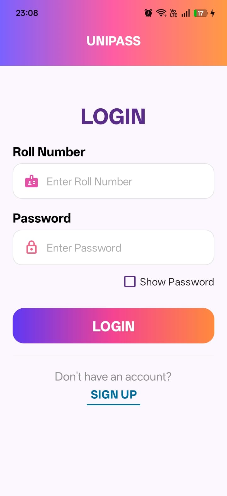
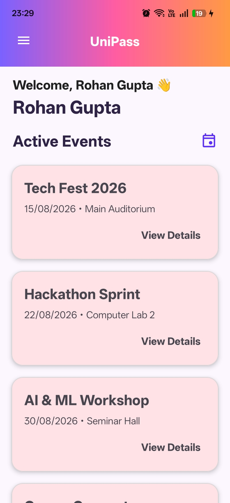
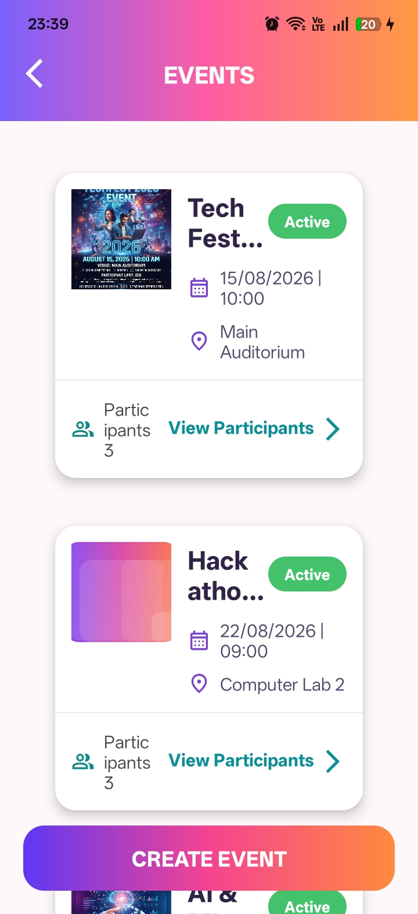
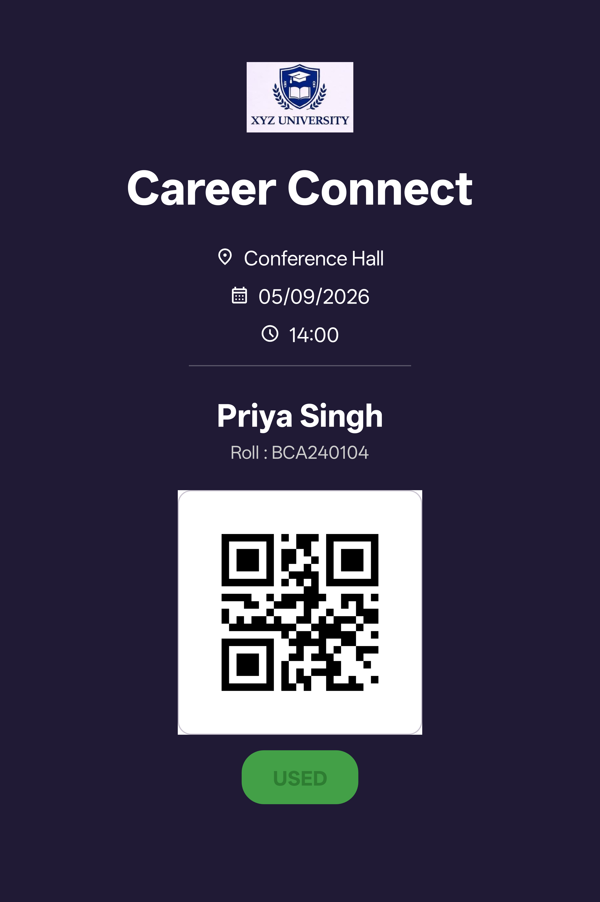
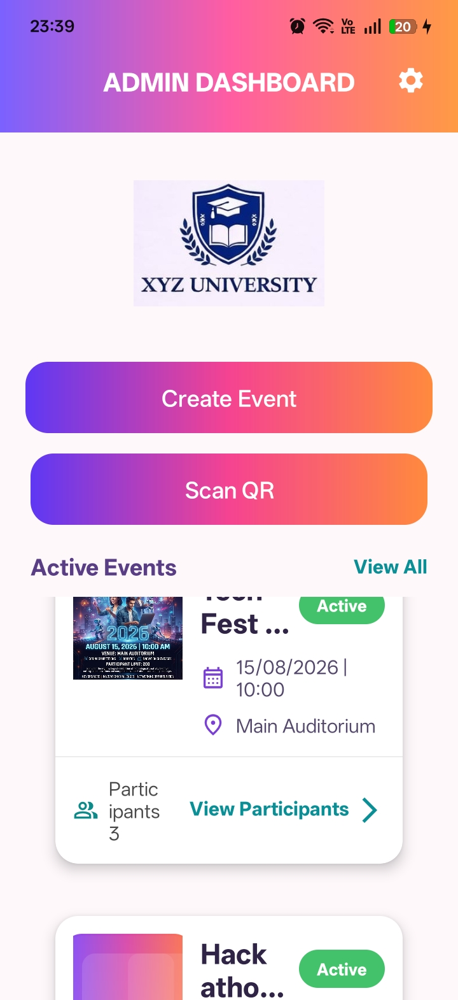
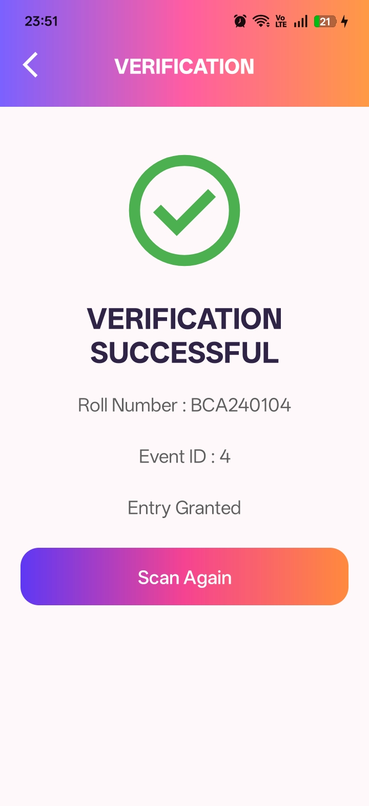

# UniPass - Campus Event Pass System

UniPass is an Android application developed to simplify campus event management through digital event passes and QR code verification. This project was developed as part of my BCA coursework with the goal of building a practical event management application inspired by real-world campus event workflows rather than a simple academic demonstration.

The application provides separate modules for administrators and students. Administrators can create and manage events, monitor registrations, view participants, and verify entries using QR codes. Students can browse events, register for them, receive a digital event pass, and download it for future use.

---

## Features

### Student Module
- Student registration and login
- Browse available events
- Register for events
- View registered events
- Digital QR event pass
- Download event pass
- Student profile management

### Admin Module
- Admin authentication
- Create, edit and delete events
- View all participants
- Scan and verify QR passes
- View event entry logs
- Manage event status
- Dashboard with event statistics

---

## Tech Stack

- Java
- Android Studio
- Room Database
- RecyclerView
- Material Components
- ZXing QR Code Library (QR Code Generation & Scanning)

---

## Architecture

- Android (Java)
- Room Database
- DAO Pattern
- XML-based UI

---

## Project Structure

```
app
├── database
│   ├── dao
│   ├── entities
│   └── AppDatabase
├── ui
│   ├── admin
│   ├── student
│   ├── auth
│   ├── adapter
│   └── qr
├── utils
└── res
```

---

## Screenshots

| Student Login | Student Dashboard |
|---------------|-------------------|
|  |  |

| Event List | Digital Pass |
|------------|--------------|
|  |  |

| Admin Dashboard | QR Verification |
|-----------------|-----------------|
|  |  |

---

## Future Improvements

- Push notifications for upcoming events
- Cloud database integration using Firebase
- Attendance analytics
- Multi-language support
- Event search and filtering
- Dark mode
- Student ID card integration

---

## Status

The project is under active development. Core functionality has been implemented, and UI refinement and additional enhancements are currently in progress.

---

## Author

**CyraTechZenith**
